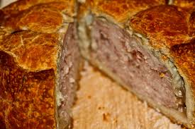

:toc:
:date: 2015-01-05 11:40
:source-highlighter: pygments
:title: Building an API
:date: 2015-01-05 11:40
:comments: true
:sharing: true
:source-highlighter: pygments
:toc: right
:toc-title: Getting Started
:toclevels: 6

:includedir: .
ifdef::env-doc[]
:includedir: guide/3-events
endif::[]

Today, you will

* Learn about events, using Photon
* Persist updates to the Menu using Event Sourcing
* Persist Orders as Events and Event Source the Orders Microservice
* See application level Eventual Consistency in both services

include::{includedir}/../12daypromo.adoc[]

TODO - what to do  ...

## Summary

You now have two services interacting with each other in a Reactive way.

You have event sourced them, using Photon as the event store.

In the next episode of the series, you will investigate various techniques to test these
services, individually and sustemically.
