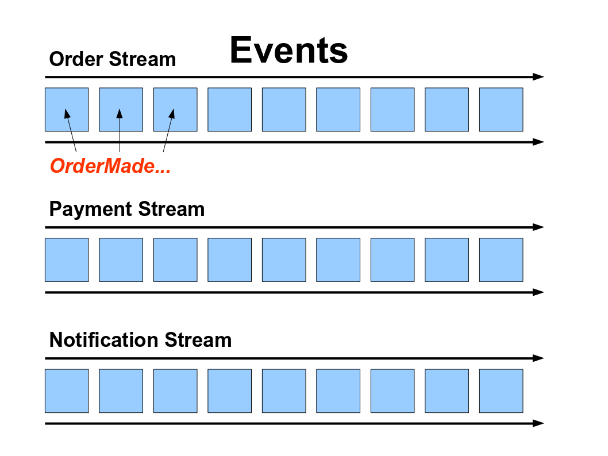

:toc:
:date: 2015-01-05 11:40
:source-highlighter: pygments
:title: Building an API
:date: 2015-01-05 11:40
:comments: true
:sharing: true
:source-highlighter: pygments
:toc: right
:toc-title: Getting Started
:toclevels: 6

:includedir: .
ifdef::env-doc[]
:includedir: guide/3-events
endif::[]

TIP: This guide is maintained at https://github.com/muoncore/12-days-of-muon Please submit issues at that repository.

Today, you will

* Learn about events, using Photon
* Persist updates to the Menu using Event Sourcing
* Persist Orders as Events and Event Source the Orders Microservice
* See application level Eventual Consistency in both services

include::{includedir}/../12daypromo.adoc[]

## Get Started with Events

You may have come across the term _event_ in terms of application integration and communication.

At its simplest, an event is a broadcast describing something that has happened in a system.
THis style of integration is often used in User Interfaces, as they tend to be highly complex systems
with particular threading pressure.

Building a distributed Microservice style system has many of the same pressures. We can use the concept of events
to build the a distributed system.

On top of regular event semantics, we will be using a concept known as _event sourcing_. This is an approach invented by Greg Young,
used in the concext of Domain Driven Design.

Event sourcing says that you can build the state of a component by replaying all the things that have happened that affect it.

These things, events, need to be persisted externally from the component in question, and then used to build its state.

In the Muon world, following our philosophy of adding systemic value through protocols and services, we have a service *Photon*, that performs
event persistence, in the form of streams. We additionally have *Event Protocols*, permitting event emit and arbitrary replay, that
Photon provides the server side implementation of.

Your code can use the event clients, and gain access to events, using Photon or any event store implementing the same protocols.

[[streams]]
.Streams in Photon

## The Menu

The Menu we want to display is a simple data structure, like this JSON representation

[source, js]
----
[
  {
     "name": "Apple Pie",
     "id": "apple-pie",
     "description": "A pie, with apples",
     "price": "5.99"
  },
  // .... more items
]
----

The question we ask is where does this data come from, and how to we change it?

To make an event sourced approach work, you have to understand how to build this structure
based upon the incremental changes to it via the events.

These are applied in order via a functional approach (ideally a true function).

### Adding to the Menu

To start with, we need to understand the events that will be used to build this Menu domain.
This process is known by many names (eg, link:http://ziobrando.blogspot.de/2013/11/introducing-event-storming.html[Event Storming]),
and involves modelling your domains and seeing what happenings are going on. These are you events.

In the case of the Menu, we will start with two things we want to happen, adding a product and updating the price.

These will be known as _ProductAdded_ and _PriceUpdated_

Muon supports events in all implementations, including the CLI.

You can emit the above events from the CLI like so

.Product Added Event via the Muon CLI
----
> muon event '{ "event-type": "ProductAdded", \  <1>
      "stream-name": "menu",                  \  <2>
      "payload": {                            \  <3>
                "name": "Apple Pie",          \
                     "id": "apple-pie",       \
                     "description": "A pie, with apples",\
                     "price": "5.99"  \
             }}'
----
<1> The type of the event
<1> The logical stream to persist to. This is used to trigger a replay.
<1> The payload, the data we need to update the Menu aggregate

.Price Updated Event via the Muon CLI
----
> muon event '{ "event-type": "PriceUpdated", \
      "stream-name": "something",             \
      "payload": {                            \  <1>
               "id": "apple-pie",             \
               "price": "5.99"                \
       }}'
----
<1> Note we only need to pass the delta of the data we are updating.

Between them, these two events give us the enough information to build the data structure above.

Next, we will use this raw state to build the menu data structure.

### Building the Menu state from the Stream

You have many options for where you are going to store the Menu data. For this data,
we can just store it in memory, as it will be very small.

The event source approach will give us all the durability guarantees we need and handle our
consistency in the way we want. The data is small enough to query programmatically.

If you have a larger data set, you can still take advantage of event sourcing in the same way
as shown here, but you will likely need a more optimised query engine to work with.

Our goal now it to take the service from the previous guide and update it to build its state from
the above two events.

Taking the Menu service from the previous tutorial, we need to udpate it

## Summary

You now have two services interacting with each other in a Reactive way.

You have event sourced them, using Photon as the event store.

In the next episode of the series, you will investigate various techniques to test these
services, individually and sustemically.
