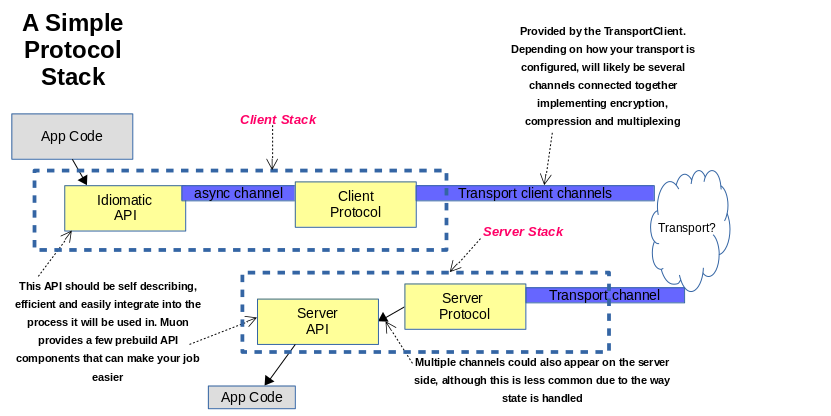

:toc:
:source-highlighter: pygments
:title: Create a Stack
:source-highlighter: pygments
:toc: right
:toc-title: Create a Stack
:toclevels: 6

:includedir: .
ifdef::env-doc[]
:includedir: guide/
endif::[]

## Create a new Muon Stack

A Stack is one of the central concepts of Muon, it lets you implement a particular form of communication as a series of messages and do so in a highly portable, straight forward way. As such, it lets you easily implement _Reactive_ architectural principles for Microservices and other types of distributed system (eg, browser/ server etc)

A Protocol Stack in Muon defines the message interchange that implements the communication you want (which we call a _Protocol_) and wraps that in a language idiomatic API to make it easy to use.

Generally, a Muon stack is used to implement and encapsulate some technical interactions between 2 to many services rather than trying to implement a business workflow or business process. Examples of these are link:https://github.com/muoncore/stack-rpc[RPC], link:https://github.com/muoncore/stack-reactive-streams[Reactive Streams], link:https://github.com/muoncore/stack-event[Events]. If you are looking to map a business process, you may want to look at link:http://muoncore.io/submodules/newton/doc/index.html#process-managers-sagas[Newton sagas]

This is not something you would be expected to do every day, rather taking a general pattern of communication you see a lot and distill it into a single stack.

### Stack Concepts

Muon takes the idea of _channels_ and makes them networked. In building a stack, your job is to assemble a set of channels, connect them together and decide what messages should flow over them, in what order, what they mean and what API should be used to interact with them.

When building a stack, you are designing both ends of the communication, not just a client or server.

Here is a standard stack showing the main components and where they come from.

.Stack Concepts

In the above diagram, there are two portions to the stack, the client and the server. The only distinction between them is which initiates the connection between them. After the connection has been created, they are effective peers and can both send and receive messages as wanted, either can end the conversation and close the channel.

The APIs are exposed to application code, and so should take into the account the runtime and language that you are targetting. Inside the stack you will be using messaging and channel semantics, if your target developers are used to this you _could_ expose that directly. It is highly unlikely that this is actually what you want however, and so you should design an API that works for your developers and then map that internally onto messages coming from your protocol machines.

### Designing a new Stack

A stack is a message interchange, a conversation. The first thing you should do then is to design the messages and what they should express in a conversation. A messaging protocol is effectively a Finite State Machine, and so using the design approaches that are valid for FSM design will work well here. Once you have designed the messages, you can code up the Protocol machine to express those, then implement the API to manage the lifecycle of it all.

#### The Protocol

We will design a full featured protocol to interact with some remote systems. This fictional protocol we will call "continuous function".

Protocols in Muon are made up of messages following a standard schema. When passed to a transport, the schema is

[source,javascript]
----
{
    "target_service": "",
    "origin_service": "",
    "protocol": "",
    "step": "",
    "content_type": "application/json",
    "channel_op": "normal",  // or closed
    "payload": // byte array
}
----

This is all managed by Muon Core, which provides functions for creating messages and handling encoding/ decoding. To turn these into a functioning protocol, you decide what *step* messages you will have, and what payloads that will imply.

In our simple protocol, we will

* Send a message to a remote system with the step `RegisterFunction` that instructs the remote that it wants an answer to a question. The payload will contain a piece of text to test against and `X`, how often the answer should be sent back.
* The remote will send messages with the step `answer` and a payload containing a `text` property.
* Every X seconds, the remote will send back the answer.
* After Y answers, the client will close the connection, shutting down the conversation

This is kind of like RPC, but simpler and a long running aspect to it.

#### Building a Client

The aim of building a Muon stack is to give a nice, user friendly API on top of distributed coordination/ messaging operation. You need to decide what this means for your API, such as whether it should be synchronous or not, the parameters and interactions that will happen.

In this case, we have an initial communication, passing the register text, along with how often you wish to be notified, and then some mechanism will be needed to pass the response back.

##### Client API

Here is an example API, which uses a simple method call and passes a callback function for async notification of results. The function will be invoked every time you get a response back. Consider other APIs you could provide, some synchronous option, or change to a streaming API using Reactive Streams or similar.

[source,java]
----
include::{includedir}/continuous-function/src/main/java/io/muoncore/example/ContinuousFunctionClient.java[]
----

This is implemented by creating a client class that takes the Muon object and uses the `TransportClient`. `Discovery`, `Codecs` and combining things together using Channels.

[source,java]
----
include::{includedir}/continuous-function/src/main/java/io/muoncore/example/protocol/continuousfunction/ContinuousClient.java[]
----

#### Building a Server

Providing a Server Stack is slightly different. You still have a managing object, that implements `ServerProtocolStack`. This object is provided to Muon Core for it to manage the lifecycle of. It provides `ChannnelConnections` on demand. Messages flow up and down the `ChannelConnection`, with each connection being a conversation with some remote service. Generally, conversation state is associated with the `ChannelConnection

The basic API of a `ServerProtocolStack` is

[source,java]
----
ProtocolDescriptor getProtocolDescriptor();                   <1>
Map<String, SchemaDescriptor> getSchemasFor(String endpoint);     <2>
ChannelConnection<MuonInboundMessage, MuonOutboundMessage> createChannel();  <3>
----
<1> Provide information about the stack for `introspection`.
<2> Optionally, provide schema/ type information, given a nominal endpoint, names of which will have been supplied in (1)
<3> Main function. Invoked by Muon Core whenever a new connection is opened for the protocol this stack provides.

Implementing this API is mostly about creating ChannelConnections and putting the Protocol behind them to trade messages with the client. You may notice that the `ChannelConnection` is the other way around in its generic information (MuonInbound vs Outbound), but that they otherwise match. The two channels are logically c

[source,java]
----
include::{includedir}/continuous-function/src/main/java/io/muoncore/example/protocol/continuousfunction/ContinuousServer.java[]
----
<1> Return a list of the available schemas used by the server, both inbound and outbound. Accessible via the introspection protocol.
<2> Get the full protocol descriptor, used by introspection.
<3> Open a channel to this protocol. This is the core API. You must provide an implementation of the channel interface that is fully connected to any server protocol, managing apis and server side state.

#### Building the Protocol Machines

The API is the part of the system that makes messaging easy to use. As such, you should make it intuitive and represent the ideas you are talking about simply and to the point.   Underneath the API is a messaging system that uses the facilities of Muon Core to find and talk to remote systems in a structured way using messaging.

This is known in Muon as a "protocol". It is fairly free form in how it _can_ work, there is no interfaces or apis that must be implemented to make it work. In all cases you need some code to translate interactions with the stack API into Muon messages that are sent down a channel to some remote system and on the way back again convert the inbound messages into something useful.

There are best practice patterns for implementing these protocols, however. If you want your protocol to be fully portable, implement it as a `JSProtocol`. This allows your core messaging interactions to be written once and then integrated into the various implementations of Muon Core, only needing to implement the API in each runtime you want to support.

##### Java embedded protocol

To make a new server side stack, you implement the `ServerStack` interface and then register it in the server stacks registry. Generally, this is done within a managing object that registers itself.

This implementation of `ServerStacks` is

Here is the continuous function client protocol implemented in Java

[source,java]
----
include::{includedir}/continuous-function/src/main/java/io/muoncore/example/protocol/continuousfunction/ContinuousServer.java[]
----

##### JSProtocol version

One potential problem with the above is having to change the implementation of the protocol and manage that change across different languages and runtimes. It is possible to implement the protocol section in a javascript module and access that

Here is the same protocol implemented using JSProtocol and integrated into the stack

[source,java]
----
include::{includedir}/continuous-function/src/main/java/io/muoncore/example/protocol/continuousfunction/ContinuousJSServer.java[]
----

The JSProtocol implementation looks like this

[source,java]
----
include::{includedir}/continuous-function/src/main/resources/continuous-server.js[]
----

This is equivalent to the above Java implementation, with the advantage that it can also be used within another Muon runtime environment to give compatible behaviour

### Testing the Stacks

There are few different ways to test your shiny new stacks, depending how much infrastructure you want to include in the test.

Taking Muon Java as the basis, you can

* Unit test the stacks as normal, mock the transport client/ server api as appropriate, with most expectations set as "message X received", "message Y sent"
* Instantiate the client/ server and attch their channels together using `Channels.connectAndTransform`. This tests the stacks against each other as an integration test, with none of the machinery of a transport/ discovery/ compression etc.
* Instantiate two muon instances, use the in memory transport and attach the client/ server. A full integration test

Generally, it is preferred to implement a test of each kind to ensure compatibility with the different messages that can be created at each level.

The Muon transport layer will emit `ChannelFailed` and `ServiceNotFound` messages in some circumstances and your protocol *must* receive and correctly handle these to clean up/ inform the app code via the API, if appropriate.
